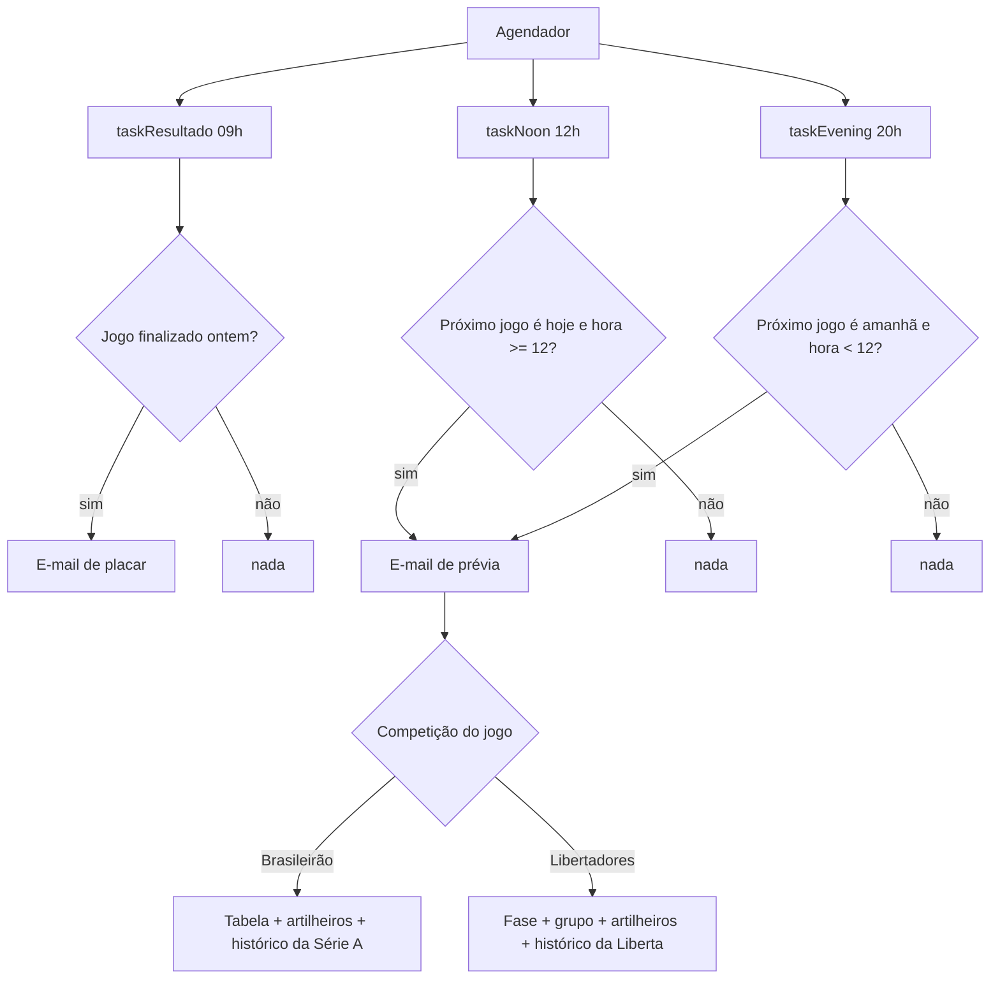

# flamengo-bot 🔴⚫

Bot que avisa por e-mail sobre os jogos do **Clube de Regatas do Flamengo** — uma prévia enriquecida **antes** de cada jogo e o placar **depois** da partida.

Fonte de dados: **[football-data.org](https://www.football-data.org/)** (plano **gratuito**, que cobre o **Campeonato Brasileiro Série A** e a **Copa Libertadores**).

## Índice

- [O que o bot envia](#o-que-o-bot-envia)
- [Como funciona (arquitetura e fluxo)](#como-funciona-arquitetura-e-fluxo)
- [Estrutura de arquivos](#estrutura-de-arquivos)
- [Variáveis de ambiente](#variáveis-de-ambiente)
- [Como rodar](#como-rodar)
- [Testar a qualquer momento](#testar-a-qualquer-momento)
- [Referência das funções](#referência-das-funções)
- [Limitações do plano gratuito](#limitações-do-plano-gratuito)

## O que o bot envia

### 📨 Antes do jogo (prévia enriquecida)

As seções específicas **se adaptam à competição do próximo jogo** (Brasileirão ou Libertadores):

- **Cabeçalho:** adversário, competição, data/horário, mando de campo e estádio.
- **Classificação:** no Brasileirão, posição/pontos/V-E-D/saldo. Na Libertadores, a **fase** (grupos, playoffs, oitavas…) e a **campanha no grupo** do Flamengo.
- **Forma recente:** últimos 5 jogos de **todas as competições** (🟢 vitória / 🟡 empate / 🔴 derrota).
- **Histórico:** últimos 5 jogos **na competição do jogo**, com placar.
- **Confronto direto (H2H):** até 5 jogos contra o próximo adversário, com **ressalva da competição** quando não foi pelo Brasileirão. Se nunca se enfrentaram no período disponível, avisa que é **confronto inédito**.
- **Artilheiros:** top 5 da competição do jogo, com os jogadores do Flamengo destacados.

### 📣 Depois do jogo (placar)

- Placar final, competição, resultado (vitória/empate/derrota), data e mando — para **qualquer competição**.
- Enviado no dia seguinte de manhã (checagem das **09h**), para todo jogo que aconteceu no dia anterior.

## Como funciona (arquitetura e fluxo)

O bot roda **três checagens** por dia, cada uma responsável por uma janela de tempo. Todas as comparações de data/hora usam o fuso **America/Sao_Paulo**.

| Horário (BRT) | Checagem        | Envia quando…                                             |
| ------------- | --------------- | --------------------------------------------------------- |
| **09h**       | `taskResultado` | houve jogo do Flamengo **ontem** → e-mail de placar       |
| **12h**       | `taskNoon`      | há jogo **hoje à tarde/noite** (hora ≥ 12) → prévia        |
| **20h**       | `taskEvening`   | há jogo **amanhã de manhã** (hora < 12) → prévia           |



**Regras de disparo (por que não há spam nem duplicidade):**

- **Prévia só no dia do jogo.** A prévia só sai quando a data do próximo jogo (em Brasília) casa com o alvo (hoje à tarde/noite, ou amanhã de manhã). Sem isso, o bot reenviaria o mesmo jogo todo dia até ele acontecer.
- **Placar só do jogo de ontem.** A regra "data do jogo = ontem", rodada de manhã, garante que cada resultado é enviado **exatamente uma vez**, sem precisar de banco de dados ou estado — o que é essencial no GitHub Actions, onde cada execução começa do zero.
- **Próximo jogo = o mais próximo de qualquer competição.** `fetchNextGame()` pega o jogo agendado mais próximo no tempo, seja Brasileirão ou Libertadores. Numa semana com os dois, cada um dispara no seu dia.

## Estrutura de arquivos

```
flamengo-bot/
├── index.js       # Entry do Modo A (sempre ligado): inicia o agendador node-cron
├── runOnce.js     # Entry do Modo B (execução única): roda as checagens e encerra
├── schedule.js    # Orquestra as 3 checagens, o day-gate e a montagem/envio dos e-mails
├── api.js         # Cliente da football-data.org (jogos, tabela, artilheiros, grupo)
├── format.js      # Helpers de data, cálculos (forma/H2H/histórico) e montagem do HTML
├── fallback.js    # Mensagem amigável quando não há jogos agendados
├── email.js       # Envio via nodemailer (Gmail) — um ou vários destinatários (BCC)
├── testar.js      # Testes manuais (prévia, Libertadores, placar, fallback)
└── .github/workflows/game.yml   # Agenda diária no GitHub Actions
```

## Variáveis de ambiente

Crie um arquivo `.env` na raiz do projeto com:

| Variável              | Descrição                                                                     |
| --------------------- | ----------------------------------------------------------------------------- |
| `FOOTBALL_DATA_TOKEN` | Token da [football-data.org](https://www.football-data.org/client/register).  |
| `FLAMENGO_TEAM_ID`    | ID do Flamengo na football-data.org (é **`1783`**).                            |
| `EMAIL_FROM`          | E-mail remetente (conta Gmail).                                               |
| `EMAIL_PASS`          | **Senha de app** do Gmail (requer 2FA) — não use a senha normal da conta.     |
| `EMAIL_TO`            | E-mail(s) que vão receber os avisos. Aceita **vários**, separados por vírgula: `pedro@x.com, maria@y.com`. |
| `RUN_ON_START`        | Opcional. Se `false`, não executa a checagem ao iniciar (Modo A).            |

> **Vários destinatários:** liste os e-mails separados por vírgula no `EMAIL_TO`. Todos são enviados em **cópia oculta (BCC)** — cada pessoa recebe o e-mail sem ver o endereço das outras.

## Como rodar

O bot tem dois modos de execução — escolha um conforme onde vai hospedar.

### Modo A — Sempre ligado (`node-cron`)

Indicado para um servidor no ar 24/7 (VPS, Render, Railway, Fly.io ou seu PC ligado). O processo fica vivo e dispara sozinho às 09h, 12h e 20h.

```bash
npm install
# crie o arquivo .env (ver tabela acima)
node index.js
```

Para não disparar a checagem imediatamente ao iniciar, defina `RUN_ON_START=false`.

### Modo B — Execução única (GitHub Actions ou cron do SO)

Indicado para rodar de graça sem manter servidor ligado. Um agendador externo acorda o bot uma vez por dia; ele faz **as três checagens** (placar de ontem + prévia de hoje/amanhã) e encerra.

```bash
node runOnce.js
```

**GitHub Actions (recomendado):** o workflow em [`.github/workflows/game.yml`](.github/workflows/game.yml) já roda todo dia às 12h (horário de Brasília) e também manualmente (aba **Actions → Run workflow**). Basta cadastrar as *secrets*:

1. **Settings → Secrets and variables → Actions → New repository secret**.
2. Cadastre: `FOOTBALL_DATA_TOKEN`, `FLAMENGO_TEAM_ID`, `EMAIL_FROM`, `EMAIL_PASS`, `EMAIL_TO`.

> Rodando uma vez por dia ao meio-dia, essa única execução cobre os três casos: o **placar de ontem**, o **jogo de hoje à tarde/noite** e o **jogo de amanhã de manhã**.

**Alternativa — cron do SO:** agende `node runOnce.js` pelo `cron` do Linux/macOS ou pelo Agendador de Tarefas do Windows.

## Testar a qualquer momento

Para validar o envio sem esperar os horários programados, use `testar.js`:

```bash
node testar.js                    # prévia: busca o jogo real e ENVIA o e-mail
node testar.js --dry              # prévia: só mostra o HTML no console, NÃO envia
node testar.js --liberta          # prévia do próximo jogo da Libertadores
node testar.js --fallback         # força a mensagem de "sem jogos" (fallback)
node testar.js --resultado        # placar: último jogo finalizado, ENVIA o e-mail
node testar.js --resultado --dry  # placar: só mostra o HTML no console
```

As flags combinam, ex.: `node testar.js --liberta --dry`.

## Referência das funções

### `api.js` — cliente da football-data.org
Todas as chamadas usam o header `X-Auth-Token` e tratam erros retornando `null` (degradação graciosa).

- `fetchNextGame(code?)` — próximo jogo agendado; com `code` (ex.: `"CLI"`) filtra por competição. Retorna o jogo **normalizado** (`teams`, `fixture`, `competicao`, `competicaoCode`, `stage`).
- `fetchClassificacao(teamId)` — linha do Flamengo na tabela do Brasileirão.
- `fetchGrupoLiberta(teamId)` — grupo/campanha do Flamengo na Libertadores.
- `fetchArtilheiros(limit, teamId, code)` — top artilheiros de uma competição.
- `fetchJogosFinalizados(teamId, dias)` — jogos finalizados (janela ~2 anos), do mais recente ao mais antigo. Uma chamada alimenta forma, histórico, H2H e placar.

### `format.js` — datas, cálculos e HTML
- `horaBrasilia`, `dataBrasilia`, `dataCurta`, `dataBrasilISO` — formatação no fuso America/Sao_Paulo.
- `resultadoParaTime`, `calcularForma` — resultado (V/E/D) e a forma recente em emojis.
- `historicoNaCompeticao`, `confrontoDireto` — histórico por competição e o H2H (com ressalva/inédito).
- `traduzirFase` — traduz as fases da Libertadores (ex.: `LAST_16` → "Oitavas de final").
- `buildResumoHtml`, `buildResultadoHtml` — montam o HTML dos e-mails de prévia e placar.

### `schedule.js` — orquestração
- `taskResultado`, `taskNoon`, `taskEvening` — as três checagens diárias.
- `montarResumoHtml(jogo)` — reúne os dados (adaptando à competição) e monta a prévia.
- `enviarResumo`, `enviarResultado` — enviam os e-mails.
- `runOnce()` — roda as três checagens uma vez (Modo B).
- `startScheduler()` (default) — agenda tudo com `node-cron` (Modo A).

## Limitações do plano gratuito

- Cobre **Brasileirão Série A** e **Copa Libertadores** — **não** cobre Copa do Brasil nem Campeonato Carioca.
- **Não expõe os autores dos gols**, por isso o e-mail de placar traz o resultado, mas não quem marcou.
- Histórico limitado a **~2 anos** (a API bloqueia temporadas mais antigas) e ~10 requisições/minuto (o bot usa ~4 por e-mail, bem dentro do limite).
